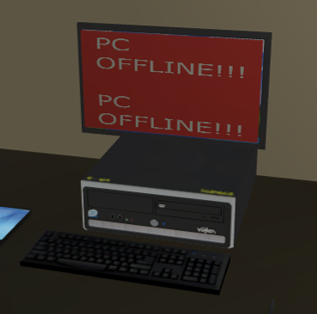

# Bad Gateway - A Game About Reparing Computers before management get angry.

This game was developed in Unity as part of a team effort for my employability module in which i was designated team leader and lead programmer.

This game consists of 3 levels in which increases in difficulty via the amount of computers that you, the IT admin needs to fix before management get angry with losing their patience as a slow company is not a happy company.

## Sample Screenshots

